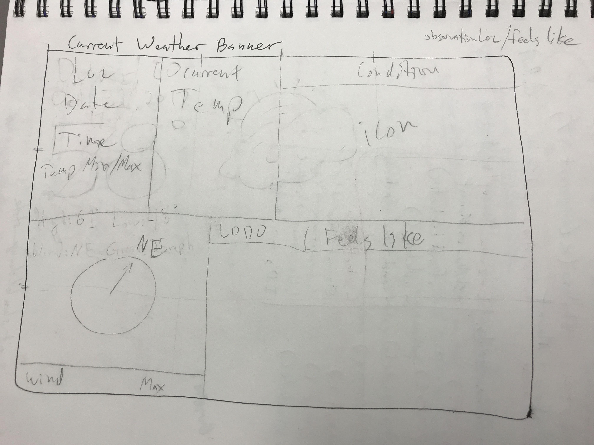
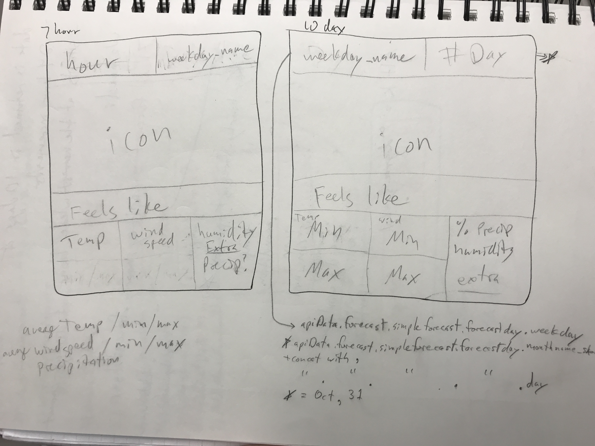
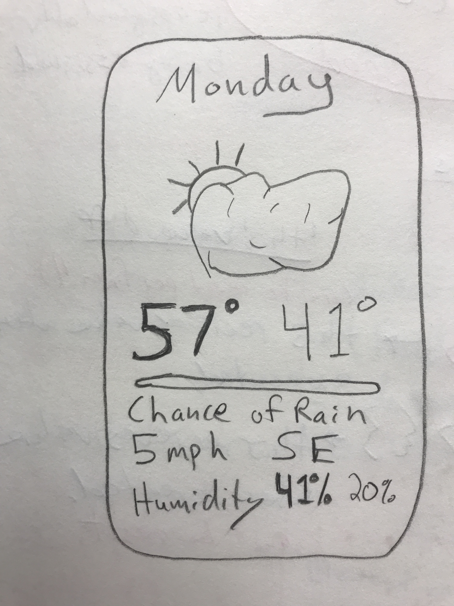

# Weathrly - Turing Mod 2 Project
## Thomas Laird & Matt Arvidson

### Weathrly was built using React and with information from the Weather Underground API. It also makes use of the autocomplete project found [here](https://github.com/t6r6l5/completeme). The project was completed over the course of 8 days. 

## Final Layout

## Mobile Layout

### Project Wire Frames

#### App - Initial Mockup

#### Current Weather - Initial Mockup

#### Card - Initial Mockup

#### Current Weather - Second Iteration

#### 7hr and 10 Day

#### Card - Second Iteration

